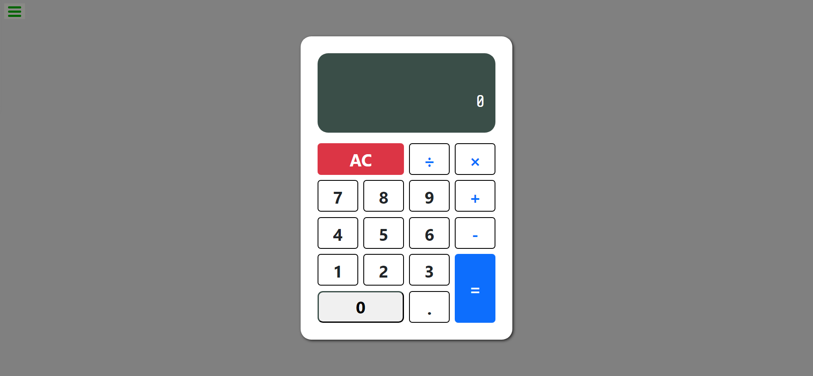

# FREECODECAMP'S JAVASCRIPT CALCULATOR PROJECT

[Vite](https://vitejs.dev/) (French word for "fast", pronounced `/vit/`, rhymes with "street") is a frontend build tool and open source project created by Evan You. [Vite 2.0](https://dev.to/yyx990803/announcing-vite-2-0-2f0a) was officially released on February 16, 2021 and aims to provide a faster and leaner development experience for modern web projects. It consists of two parts:

* A dev server with Hot Module Replacement (HMR) that serves your source files over [native ES modules](https://developer.mozilla.org/en-US/docs/Web/JavaScript/Guide/Modules)
* A build command that bundles your code with [Rollup](https://rollupjs.org), pre-configured to output highly optimized static assets for production
## Clone repo, install dependencies, and run development server

To run this project on your local machine enter these commands to clone the repo, install the dependencies with `yarn` and start the development server with `yarn dev`.

```bash
git clone https://github.com/vite-app
cd vite-app
yarn
yarn dev
```
Also make sure you have the latest version of node and npm
### Calculators Screenshot

#### What I learned
While completing this project, I came across the `eval()`

function and it was really useful. I also realized how powerful **regular expressions** could be. I literally made use of regex in the logic without applying any form of array methods

##### Author
- Twitter - [Chukwuebuka Ukoha](https://www.twitter.com/Uko1Chukwuebuka)
